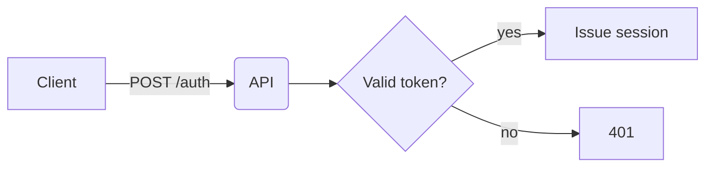
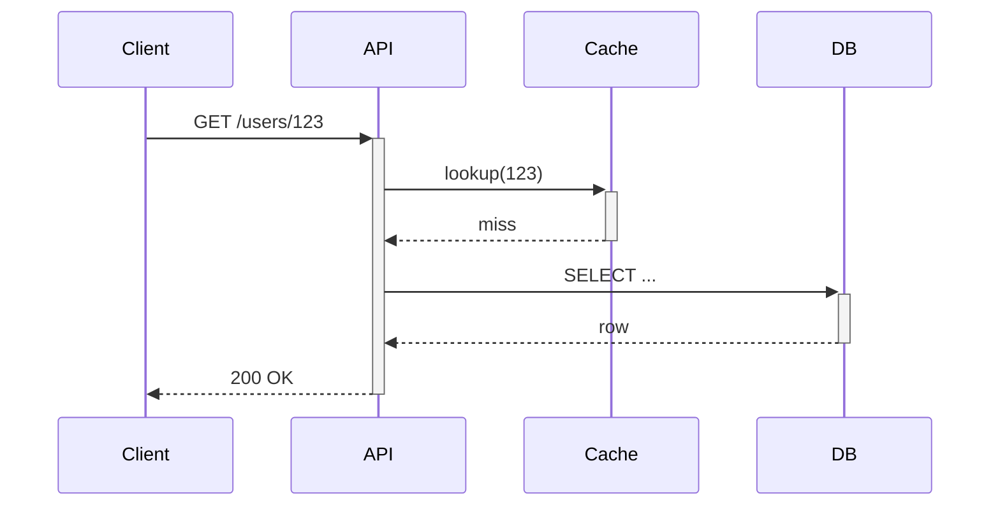
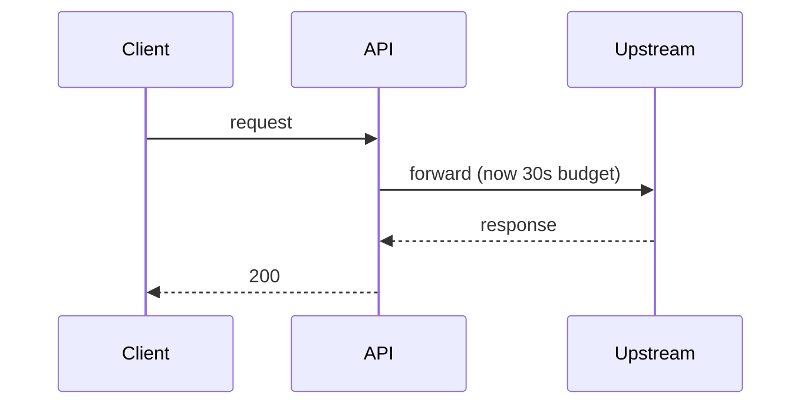

# Pull Requests

A PR description is a **permanent record**, not a disposable ticket. The current reviewer reads it once; future engineers read it when they `git blame` a line of code months or years later trying to understand *why* a change was made. Write for both audiences.

Aim for a description that answers, without the reader needing to click anywhere else:

- **Why** the change exists (motivation, linked issue, user report)
- **What** changed at a high level (not a line-by-line diff — that's what the diff is for)
- **How** to verify it works (test plan, manual steps, screenshots)
- **Risks / follow-ups** the reader should know about

## Optimizing description length and readability

Keep the **visible** description between **200 and 400 words**. Shorter than that and reviewers lack context; longer and the key details get buried under noise.

A few structural choices make a real difference:

- **Lead with a one- or two-sentence summary** of what the PR does and why, so reviewers get their bearings before reading the diff.
- **Use short paragraphs** — four to six lines each — instead of dense blocks of text. They stay scannable.
- **Break multi-step reasoning or lists of changes into bullets** rather than embedding them in prose.

### Match length to PR size

Not every PR warrants the same level of detail. A good rule of thumb:

| PR scope | Suggested description length |
| --- | --- |
| Small bug fix or typo | 50–100 words |
| Single feature or refactor | 150–250 words |
| Multi-component change | 300–400 words |
| Breaking change or migration | 400 words + a migration note |

Resist the urge to write more just because the diff is large. A long diff still only needs a description that covers **what changed, why, and what reviewers should watch for**.

When more detail is genuinely useful (full rationale, alternatives considered, exhaustive change lists), move it into a collapsed `<details>` block (see below) so the visible copy stays within the lengths above.

## GitHub markdown features

Use GitHub's advanced markdown to keep descriptions scannable. Below are the tools worth reaching for.

## 1. Alerts (callouts)

Reference: <https://github.com/orgs/community/discussions/16925>

Highlight critical information so reviewers cannot miss it. Five types, case-sensitive, on their own line:

```markdown
> [!NOTE]
> General information the reader should notice.

> [!TIP]
> Optional guidance that makes the reviewer's life easier.

> [!IMPORTANT]
> Crucial for understanding or reviewing this change.

> [!WARNING]
> Demands immediate attention — breaking change, migration required, etc.

> [!CAUTION]
> Negative consequences possible — data loss risk, security implication.
```

Use sparingly. Everything-is-important means nothing is.

## 2. Collapsed sections

Reference: <https://docs.github.com/en/get-started/writing-on-github/working-with-advanced-formatting/organizing-information-with-collapsed-sections>

Hide long output (logs, full stack traces, verbose test results, auxiliary screenshots) behind a `<details>` block so the main narrative stays readable. The content remains searchable and permanently archived.

```markdown
<details>
<summary>Full test output (142 lines)</summary>

```
$ cargo test --all
    Finished test [unoptimized + debuginfo] target(s) in 0.12s
     Running unittests src/lib.rs
...
```

</details>
```

Add `open` to start expanded: `<details open>`. Leave one blank line after `<summary>` so nested markdown renders correctly.

## 3. Code blocks with syntax highlighting

Reference: <https://docs.github.com/en/get-started/writing-on-github/working-with-advanced-formatting/creating-and-highlighting-code-blocks>

Always tag fenced blocks with a language identifier. Highlighted code is faster to read and signals intent (shell command vs. config vs. source).

~~~markdown
```rust
fn main() {
    println!("Hello, world!");
}
```

```bash
$ cargo run --release
```

```diff
- let timeout = Duration::from_secs(5);
+ let timeout = Duration::from_secs(30);
```
~~~

The `diff` language is especially useful in PR descriptions to show the conceptual change without quoting the real diff.

## 4. Diagrams

Reference: <https://docs.github.com/en/get-started/writing-on-github/working-with-advanced-formatting/creating-diagrams>

When the change touches control flow, data flow, or system architecture, a small diagram saves paragraphs of prose. GitHub renders Mermaid, GeoJSON, TopoJSON, and ASCII STL from fenced code blocks. Make sure you keep in mind Github's UI is vertical and narrow. Prefer to build diagrams that are taller rather than wider.

**Flowchart:**

~~~markdown

~~~

**Sequence diagram — useful for request/response changes:**

~~~markdown

~~~

Prefer Mermaid over pasted screenshots of diagrams: it stays editable, diffable, and readable on mobile.

## Putting it together — example skeleton

Don't start the PR with `# Summary` — that's redundant. Just start with the summary itself.

```markdown
Fixes the 5-second auth timeout that caused intermittent 504s for users on
high-latency connections (see #4821).

> [!IMPORTANT]
> Increases default request timeout from 5s → 30s. Downstream services
> relying on the old timeout should review before merging.

## Change

```diff
- let timeout = Duration::from_secs(5);
+ let timeout = Duration::from_secs(30);
```

## Flow



## Test plan

- [x] Unit test covering new timeout value
- [x] Manual: reproduced original 504 on staging, confirmed fixed

<details>
<summary>Repro logs (before fix)</summary>

```
2026-04-22T14:03:11Z ERROR upstream timeout after 5.01s
...
```

</details>
```

## Checklist before submitting

- [ ] Title is imperative and under ~70 chars
- [ ] Visible description length matches the PR's scope (see the table above)
- [ ] Reader can understand *why* without opening linked tickets
- [ ] Long logs / output / extra detail hidden behind `<details>`
- [ ] Code blocks have language tags
- [ ] Alerts used only for genuinely critical notes
- [ ] Lines are **not** split
- [ ] A future reader doing `git blame` six months from now will have what they need
